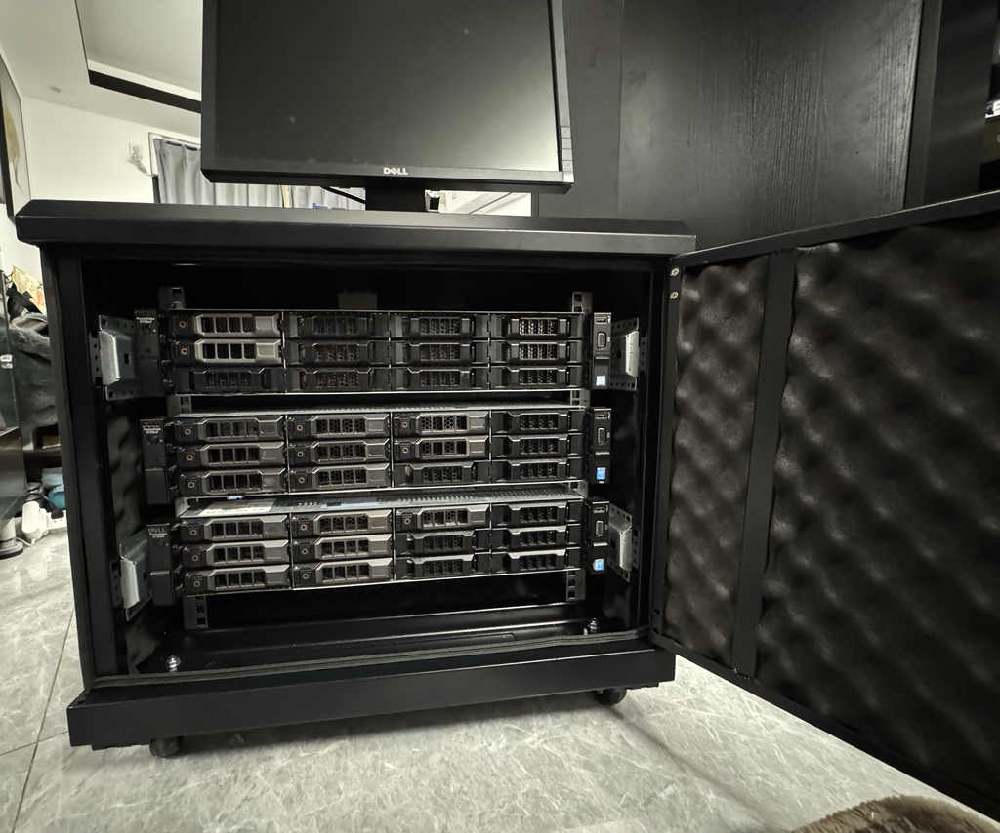
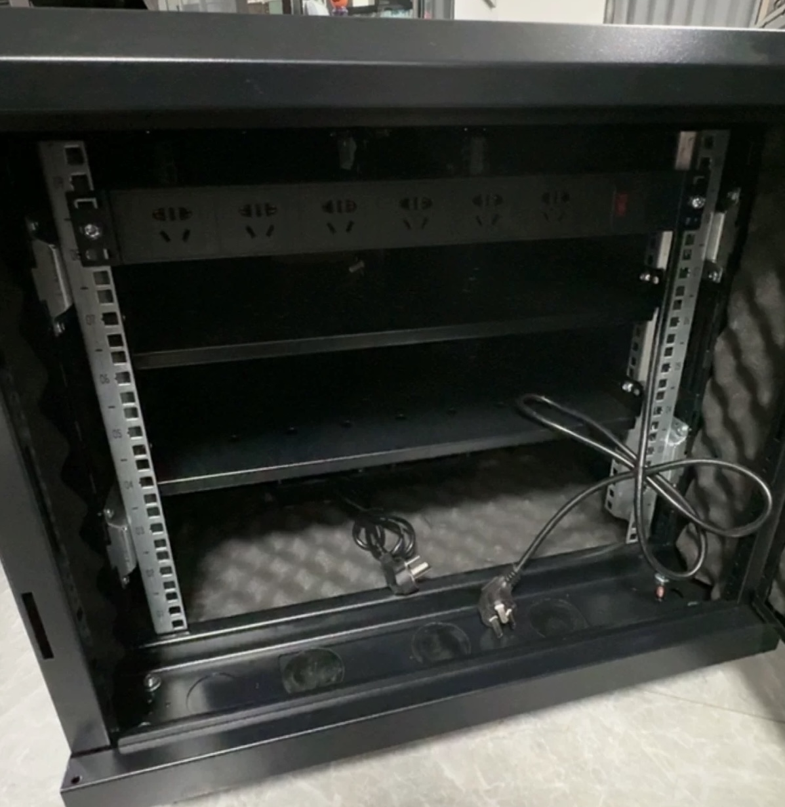
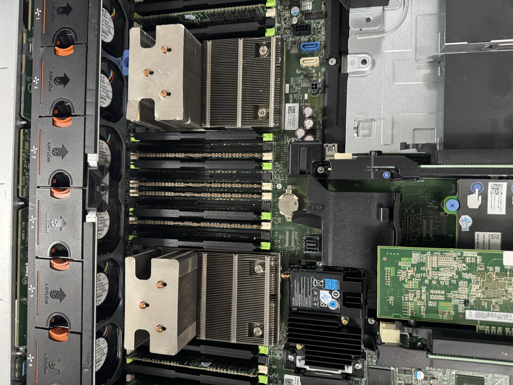
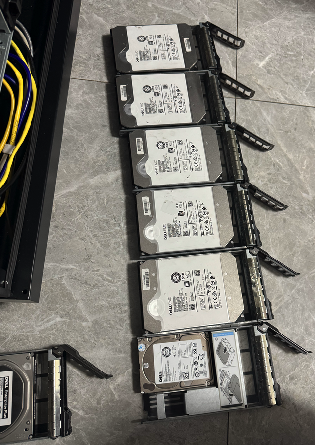
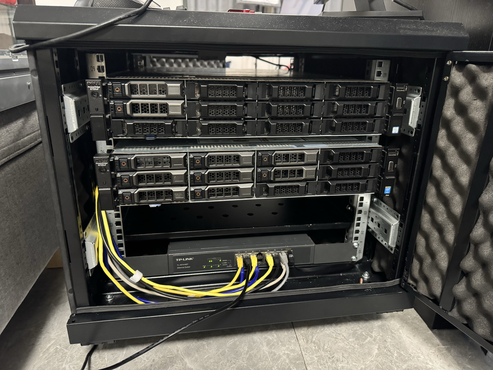
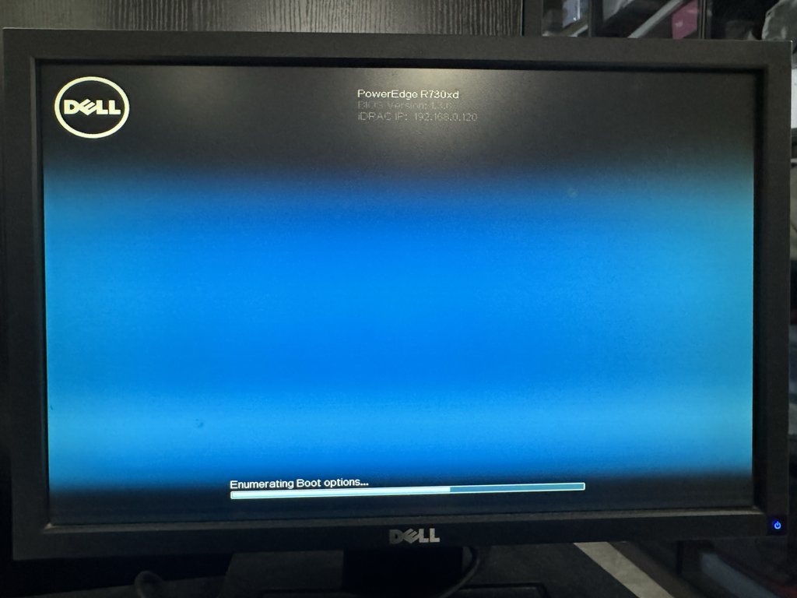
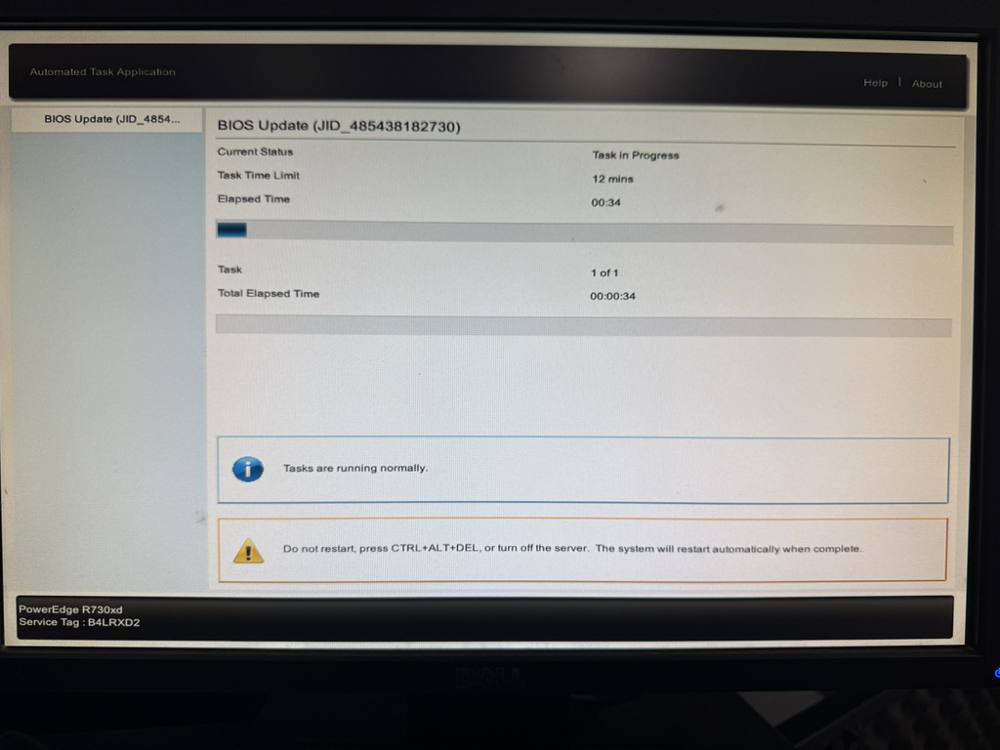
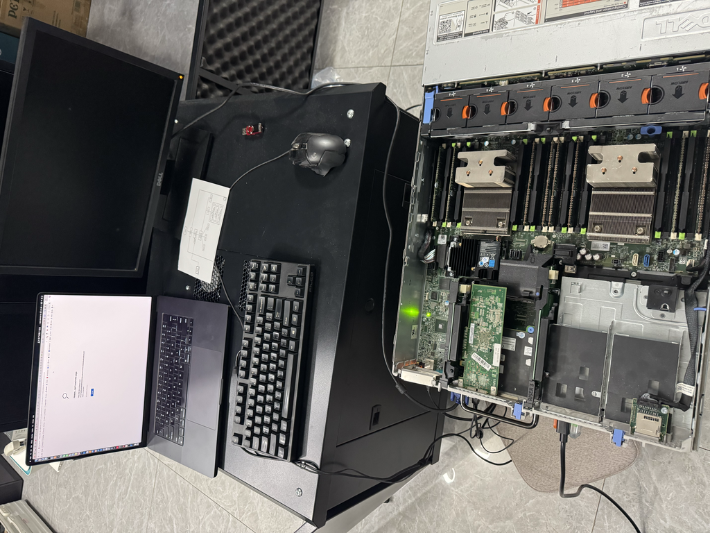
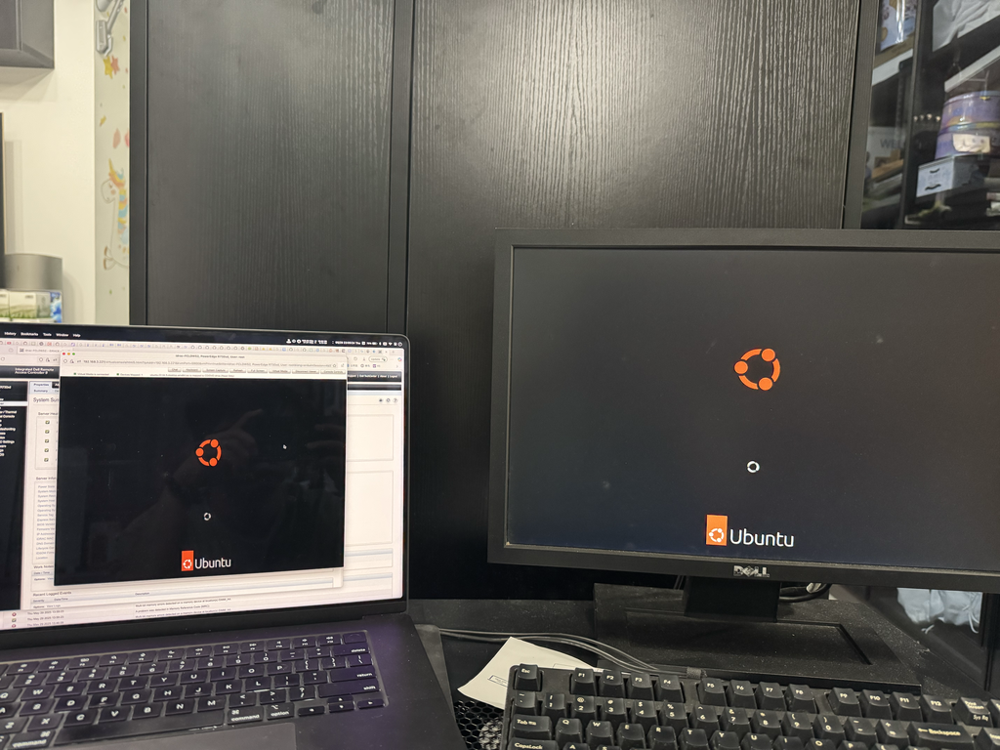
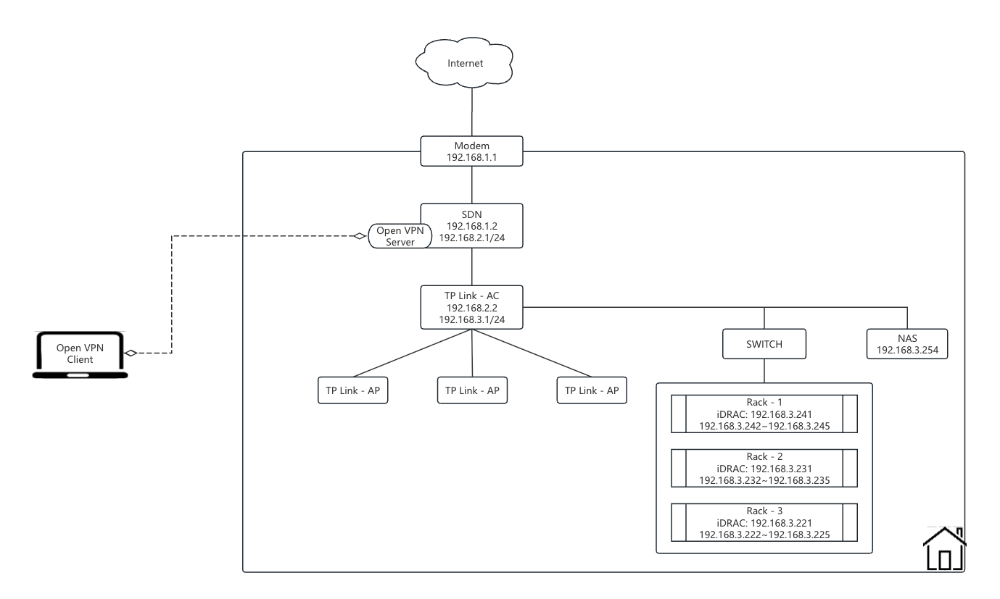

# Building My Home AI Lab with Dell PowerEdge Servers

## Introduction

Creating a home AI lab has always been a dream of mine. With the rise of generative AI, running models locally on enterprise-grade hardware is not only practical but also incredibly powerful. In this blog, I share my journey of building a home AI lab using three refurbished Dell PowerEdge R730xd servers, a 9U cabinet, a TP-Link switch, etc.





---

## Hardware Setup

### 0. **9U Rack Cabinet**

The servers are housed in a custom 9U cabinet with Fans on top and bottom and with full acoustic dampening to reduce noise. Meanwhile having 10A 2000W PDU installed.



### 1. **Dell PowerEdge R730xd Servers**

I sourced three used Dell PowerEdge R730xd servers. Each is equipped with dual Intel Xeon CPUs, abundant RAM slots, and RAID controller support. These are ideal for AI workloads and virtualization.


Each unit has:

* Dual CPU sockets (currently fitted with two heat sinks)
* 24 DIMM slots
* PCIe slots for GPU or network expansion
* Redundant power supplies



### 2. **Hard Drives**

I collected multiple Dell Enterprise Plus SAS hard drives and mounted them on sleds. These will be used to create RAID volumes for both performance and redundancy.




### 3. **Networking**

A TP-Link managed switch connects all servers together. I've configured it to use VLANs to isolate traffic types later.




### 5. Old Monitor with VGA Setup

I also spent some time setting up an old Dell monitor using a VGA cable. This helped tremendously during BIOS updates and OS installations before the remote access tools were fully configured.



---

## OS Installation & BIOS Update

### Step 0: Prepare Ubuntu bootable USB drive

First, you should have an Ubuntu bootable USB drive. Download the Ubuntu ISO from official website, and then Flash it

```
sudo diskutil umountDisk /dev/diskN
sudo diskutil eraseDisk ExFAT ud /dev/diskN

sudo diskutil umountDisk /dev/diskN
sudo dd if=ubuntu-22.04.2-desktop-amd64.dmg of=/dev/rdiskN bs=1m
```


### Step 1: BIOS & Firmware Updates

Before installing the OS, I updated the BIOS and iDRAC firmware to the latest version.



iDRAC was accessed via IP `192.168.3.x`, and Dell's Lifecycle Controller handled the BIOS update using a local ISO.

Besides, choose your perference with **RAID Configuration**


### Step 2: Ubuntu Installation

I chose Ubuntu 22.04 LTS as the base OS, why 22.04?, due to the RDP has been support by default. It offers excellent compatibility with AI frameworks like PyTorch, TensorFlow, and Docker/K8s environments.



Installation proceeded smoothly using a bootable USB, with the system showing both iDRAC console and local monitor for redundancy.



---

## Future Plans

### 0. **Auto Fans**

* I will also integrate a temperature sensor to monitor the temperature of Cabinet in real time. Based on different temperature thresholds, to automatically adjust the fan speed to ensure optimal cooling and energy efficiency.


### 1. **Networking and Access**

* Setup OpenVPN tunnel to home network extendable.



### 2. **Graph Cards**

* Add NVIDIA GPUs (P40) for model training

---

## Conclusion

This home lab provides an affordable and scalable environment to experiment with real AI workloads. If you're building your own AI lab or homelab, used enterprise servers like the R730xd are a great place to start.

Feel free to ask questions or request tutorials on setting up RAID, Ubuntu optimization, or running specific AI tools!